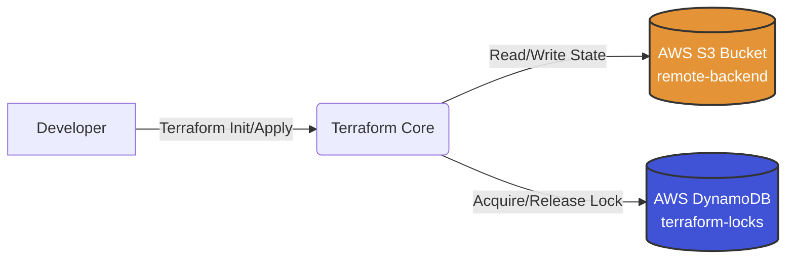

# 🛡️ Secure Cloud Pipeline


## 📖 Project Overview

This project demonstrates a **DevSecOps** approach to infrastructure provisioning. The goal is to build an automated CI/CD pipeline using **GitHub Actions** that deploys **AWS** resources via **Terraform**.

> **Crucially:** This pipeline implements a **Shift-Left Security** strategy. It acts as a gatekeeper, blocking any infrastructure deployment that fails security compliance checks (SAST, Secret Scanning, IaC Scanning).

---

## 🏗️ Architecture

### 1. Remote State Management (Implemented)

To enable team collaboration and consistency, local state storage is disabled. The project uses a **Remote Backend** architecture:



- **S3 Bucket:** Stores the `terraform.tfstate` file (encrypted).
- **DynamoDB:** Handles **State Locking** to prevent concurrent modifications (corruption protection).

### 2. CI/CD Workflow (Planned)

`Developer` ➔ `Git Push` ➔ `GitHub Actions` ➔ `Security Scanners` ➔ `Terraform Plan` ➔ `Terraform Apply` ➔ `AWS Cloud`

---

## 🛠️ Tech Stack

| Category              | Technology      | Status     |
| --------------------- | --------------- | ---------- |
| **Cloud**             | AWS (Free Tier) | 🟢 Active  |
| **IaC**               | Terraform       | 🟢 Active  |
| **Version Control**   | Git / GitHub    | 🟢 Active  |
| **CI/CD**             | GitHub Actions  | 🟡 Planned |
| **Secrets Detection** | TruffleHog      | 🟡 Planned |
| **IaC Scanning**      | Checkov         | 🟡 Planned |
| **SAST**              | Semgrep         | 🟡 Planned |

---

## ⚡ Initial Setup & Guardrails

Before writing any code, the environment was secured to emulate enterprise standards:

- **AWS Cost Management:**
- Configured **AWS Budgets** to alert on **$1 spend threshold** (prevention of "bill shock").

- **IAM Hardening:**
- Root account secured with **hardware/virtual MFA**.
- Created dedicated **IAM User** for development (following _Least Privilege Principle_).

- **Repository Security:**
- `.gitignore` configured immediately to prevent state file/secret leakage.
- Implemented **Remote State Locking** to prevent race conditions.

---

## 📅 Progress Log

- [x] **Phase 0:** Environment Setup (AWS CLI, IAM, Budgets).
- [x] **Phase 1:** Terraform Foundations & Remote Backend (S3 + DynamoDB).
- [ ] **Phase 2:** GitHub Actions & OIDC Configuration.
- [ ] **Phase 3:** Security Scanners Integration.

````

### Co teraz zrobić?
1. Wklej to do pliku `README.md` w VS Code.
2. Zapisz.
3. Wyślij do repozytorium:
   ```bash
   git add README.md
   git commit -m "Docs: Update README with architecture diagram and progress log"
   git push
````
