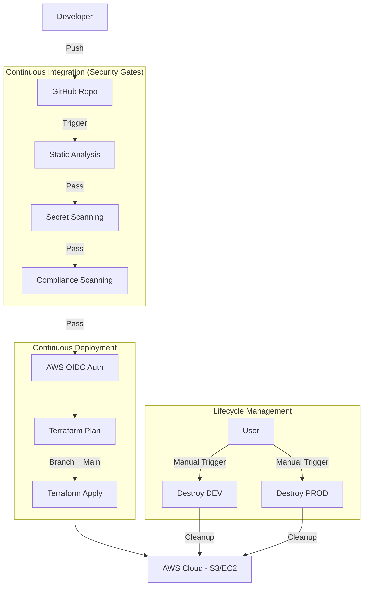

# 🛡️ AWS Secure Cloud Lab – DevSecOps Pipeline

## 📖 Project Overview

This project implements a production-grade, automated **Infrastructure as Code (IaC)** pipeline using **Terraform** and **GitHub Actions**. It demonstrates a robust **DevSecOps** workflow where security controls are integrated into every stage of the infrastructure lifecycle.

The architecture follows a **Monorepo** pattern with a multi-environment strategy, strictly separating Development (`dev`) and Production (`prod`) infrastructure and state.

### 🚀 Key Features

- **Multi-Environment Strategy:** Isolated `dev` and `prod` environments with separate S3 backend paths to prevent state corruption.
- **Shift-Left Security:** Automated scanning pipeline:
- **TFLint:** Code quality and syntax validation.
- **TruffleHog:** Deep history scanning for leaked secrets.
- **Checkov:** Policy-as-Code scanning against CIS Benchmarks.

- **Secure Authentication:** **OpenID Connect (OIDC)** federation eliminates long-lived AWS Access Keys in CI/CD.
- **Lifecycle Management:** Automated workflows for deploying (`Apply`) and decommissioning (`Destroy`) resources to manage cloud costs (FinOps).

---

## 🛠️ Architecture & Pipeline Flow

The CI/CD pipeline acts as a security gatekeeper. Code is only deployed if it passes all automated checks.



---

## 📂 Repository Structure

```text
.
├── .github/workflows/
│   ├── terraform-dev.yaml          # CI/CD for Development (Triggers on path changes)
│   ├── terraform-prod.yaml         # CI/CD for Production (Triggers on path changes)
│   ├── terraform-destroy.yaml      # Manual Cleanup for Dev
│   └── terraform-destroy-prod.yaml # Manual Cleanup for Prod
├── secure-cloud-lab-dev/           # Development Infrastructure Code
│   ├── main.tf
│   └── .tflint.hcl
├── secure-cloud-lab-prod/          # Production Infrastructure Code
│   ├── main.tf
│   └── .tflint.hcl
└── README.md

```

---

## 🔒 Security Measures (DevSecOps)

### 1. Identity & Access Management (IAM)

- **OIDC Federation:** The pipeline authenticates via a temporary token generated by GitHub and exchanged for AWS credentials. **No long-term AWS keys** are stored in GitHub Secrets.
- **Least Privilege:** The CI/CD IAM Role has a Trust Policy strictly scoped to this specific GitHub repository.

### 2. Automated Scanning Tools

- **TruffleHog:** Configured with `fetch-depth: 0` to scan the entire git commit history for credentials.
- **Checkov:** Enforces security best practices.
- _Implementation:_ Pipeline fails on critical errors.
- _Risk Acceptance:_ Non-critical lab rules (e.g., KMS costs) are explicitly waived using `# checkov:skip` annotations with justifications.

### 3. State Management

- **Remote Backend:** Terraform state is stored in a private S3 bucket.
- **State Locking:** Utilizes **DynamoDB** (`terraform-locks`) to prevent race conditions during concurrent deployments.

---

## 💻 CI/CD Workflows

### 🟢 Deployment Pipelines (`dev` / `prod`)

- **Trigger:** Push to `main` (filtered by directory path `secure-cloud-lab-dev/**` or `prod/**`).
- **Process:**

1. **Checkout:** Full history for secret scanning.
2. **Scan:** TFLint -> TruffleHog -> Checkov.
3. **Auth:** Assume IAM Role via OIDC.
4. **Plan:** Generate execution plan.
5. **Apply:** Auto-approve changes (only on `main` branch).

### 🔴 Destruction Pipelines (`Manual`)

- **Trigger:** `workflow_dispatch` (Manual Button).
- **Purpose:** Cost optimization. Allows for a one-click teardown of specific environments.
- **Isolation:** Separate workflows for Dev and Prod ensure that the `working-directory` is correctly set, targeting the specific Terraform State file for that environment.

---

## 📝 Engineering Challenges & Troubleshooting

During the development of this pipeline, several technical challenges were addressed:

1. **OIDC Thumbprint Mismatch:**

- _Issue:_ Authentication failed with `Invalid Identity Token`.
- _Solution:_ Manually updated the AWS IAM Identity Provider with the correct GitHub certificate thumbprints via AWS CLI.

2. **Shallow Clone vs. Secret Scanning:**

- _Issue:_ TruffleHog passed immediately without scanning history.
- _Solution:_ Configured `actions/checkout` with `fetch-depth: 0` to ensure deep historical analysis.

3. **Backend "Chicken and Egg" Error:**

- _Issue:_ Pipeline failed with `NoSuchBucket` when initializing the Prod environment.
- _Solution:_ Corrected `main.tf` to point to the _existing_ shared Backend S3 bucket, while using a unique `key` (`prod/terraform.tfstate`) to separate the state files.

4. **State Locking Deprecation Warning:**

- _Observation:_ Terraform warned about `dynamodb_table` being deprecated in favor of S3 native locking.
- _Decision:_ Retained DynamoDB to demonstrate knowledge of classic, industry-standard High Availability state management patterns.

---

**Author:** Filip
**License:** MIT
