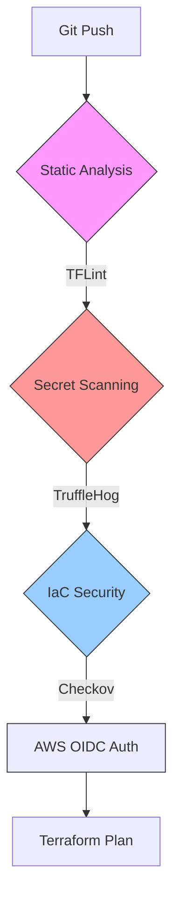

# 🛡️ AWS Secure Cloud Lab – DevSecOps Pipeline

## 📖 Project Overview

This project implements a secure, automated **Infrastructure as Code (IaC)** pipeline using **Terraform** and **GitHub Actions**.

The primary goal is to demonstrate a **DevSecOps** and **Shift-Left Security** approach. Security checks and code quality gates are automated at the earliest possible stage in the CI/CD process, ensuring that insecure or malformed code never reaches the AWS cloud environment.

### 🚀 Key Features

- **Infrastructure as Code (IaC):** Fully managed AWS resources via Terraform (S3, Versioning, Public Access Blocks).
- **Secure Authentication (OIDC):** Eliminated long-lived access keys (`AWS_ACCESS_KEY_ID`) in favor of temporary OpenID Connect federated tokens.
- **Remote State Management:** Terraform state is encrypted at rest (S3) and locked during writes (DynamoDB) to prevent race conditions.
- **Automated Security Gates:** The pipeline strictly blocks deployment if critical security vulnerabilities or secrets are detected.

---

## 🛠️ Pipeline Architecture

Every `git push` triggers a workflow that passes through a rigorous security health check before communicating with AWS.



### 1. Static Code Analysis (TFLint)

Validates Terraform syntax and AWS-specific configurations (e.g., checking for valid instance types) to catch errors before the plan stage.

### 2. Secret Scanning (TruffleHog)

Scans the entire git history (`fetch-depth: 0`) to ensure no credentials, API keys, or tokens have ever been committed.

- **Config:** Uses `--only-verified` to reduce false positives by checking if keys are active.

### 3. IaC Security Scanning (Checkov)

Audits the infrastructure code against CIS Benchmarks and best practices.

- **Policy:** The pipeline **fails** if critical issues are found.
- **Risk Acceptance:** Implemented `checkov:skip` annotations for rules not applicable to the Lab environment (e.g., skipping costly KMS encryption in favor of standard SSE-S3).

### 4. Terraform Plan & OIDC

Once security gates are passed, GitHub Actions assumes a strictly scoped IAM Role via **OIDC**, obtains temporary credentials, and generates an execution plan.

---

## 📂 Project Structure

```text
.
├── .github/workflows/
│   └── terraform-dev.yaml    # CI/CD Pipeline Definition
├── secure-cloud-lab-dev/     # Development Environment
│   ├── main.tf               # Infrastructure Definition
│   ├── .tflint.hcl           # Linter Configuration
│   └── .gitignore            # Security Exclusions
└── README.md                 # Documentation

```

---

## 🔒 Security Measures Implemented

### AWS & IAM Hardening

- **Least Privilege:** Utilization of a dedicated `devsecops-admin` user and a scoped CI/CD IAM Role.
- **MFA:** Multi-Factor Authentication enforced for Root and IAM users.
- **FinOps:** AWS Budgets configured ($1 threshold) to monitor lab costs.

### Terraform Security

- **State Encryption:** The `terraform.tfstate` file is encrypted at rest in S3.
- **S3 Hardening:** Bucket versioning is enabled (enforced by Checkov audit) to prevent data loss.

---

## 💻 How to Run

### Prerequisites

1. AWS Account.
2. Terraform & AWS CLI installed locally.
3. Remote Backend (S3 Bucket + DynamoDB Table) provisioned manually.

### GitHub Actions Configuration

1. Create an **OIDC Identity Provider** in AWS IAM.
2. Create an IAM Role with a Trust Policy scoped to your GitHub repository.
3. Add `AWS_ACCOUNT_ID` to GitHub Secrets.

### Local Testing (Scanners)

```bash
# Run TFLint
tflint --init
tflint

# Run Checkov
checkov -d secure-cloud-lab-dev --framework terraform

```

---

## 📝 Troubleshooting & Lessons Learned

During the engineering process, several critical challenges were resolved:

1. **OIDC Thumbprint Error:** The pipeline initially failed with `Request ARN is invalid`. The root cause was a missing or mismatched GitHub Certificate Thumbprint in AWS IAM. This was resolved by manually updating the thumbprint via AWS CLI.
2. **Secret Injection:** Incorrectly nesting the secret variable resulted in a malformed ARN (`arn:aws:iam::arn:aws:iam::...`). The workflow was updated to inject only the numeric Account ID.
3. **Shallow Clones in CI:** Initially, TruffleHog failed to scan history. The `actions/checkout` step was updated with `fetch-depth: 0` to enable deep history scanning.

---

**Author:** Filip
**License:** MIT
